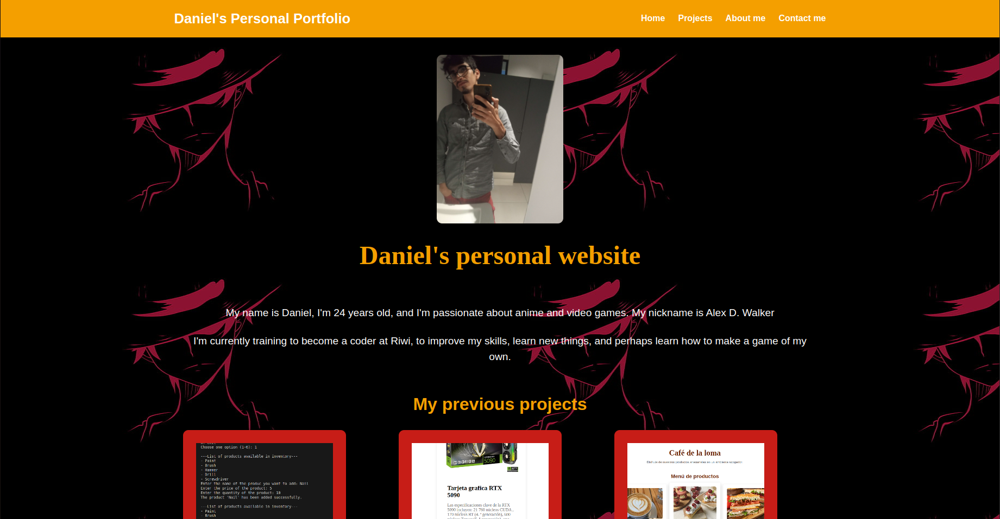

# Personal Portfolio

This project is a personal portfolio created with HTML and CSS. The goal is to showcase my skills and projects in a clear and engaging way.

## Features
* Responsive design to adapt to different devices and screen sizes
* Clear and organized structure with sections for:
+ Personal Introduction
+ Projects
+ About Me
+ Contact
* Use of CSS Variables to maintain style consistency
* Transition and hover effects to improve user experience

## Technologies Used
* HTML5
* CSS3
* Flexbox and Grid for responsive design

## How to view the project
1. Clone the repository or download it
2. Open the `index.html` file in your favorite browser

## Credits
* Created by Daniel Ariza (Alex D Walker)

## Preview

## Contact
If you have any questions or suggestions, please feel free to contact me.

* Coder Name: Daniel Alexander Ariza Mendez
* Clan: LoveLace
* Email: Danteariza85@gmail.com
* identity document: 1007253707
